# NULife
NULife

Chat with your course-mates

A platform where you can ask and answer questions, and explore the forum without the guidance of your instructors. Professors free environment where you can learn from your peers.

Sell and buy what you want

A platform where you can sell and buy different products, offer your services and post job applications. A high quality market where everything is effectively organized by making it easy for both customers and sellers to find desired products according to their categories. A list of all the catering places on campus, regularly updated live menus, notifications about new meals and discounts, opportunity to read and leave honest reviews - everything becomes possible with NULife!

Manage your time effectively

A timetable for students designed to make your study life easier to manage. It allows you to store your courses, set deadlines and share them with your peers. It synchronizes with the courses you enroll, and gives you an opportunity to plan and schedule your own tasks. It easy to create new plans, organize and assign tasks with NULife!

Don’t miss any event

A platform where you can find all the useful information about student organizations, discover upcoming events on campus and get some recommendations depending on your club of interest. Keep up-to-date with all the popular events like concerts, festivals, talks and discover new things to do every day!

Find out more on [nulife.kz](https://nulife.kz/)

### Technology

I started working on this project on August 2019, and the first release was in March 2020. The project is mostly written in kotlin, though there are other languages present:
* kotlin
* java
* xml

I used MVVM, Repository, dependency injection, Firebase as a backend service, Single activity design patterns (there is a second activity but it is a small one: AuthActivity). 

I used various libraries in production: 
* Dagger2, 
* Glide, 
* Stfalcon ImageViewer, 
* Matisse Image picker, 
* AnderoidX Room, 
* Navigation, 
* Viewpager2, 
* WorkManager, 
* Coroutines, 
* Motion layout. 

Please feel free to contact me at n.altynbek.kz@gmail.com if you have any questions. 

  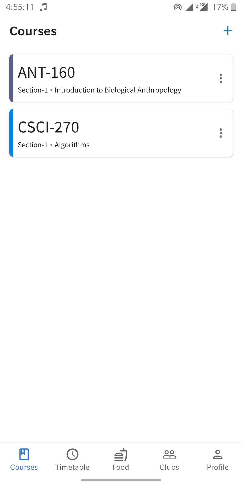
  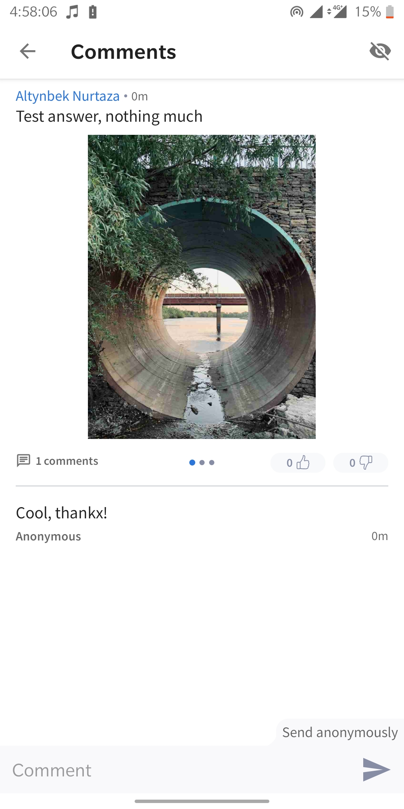
  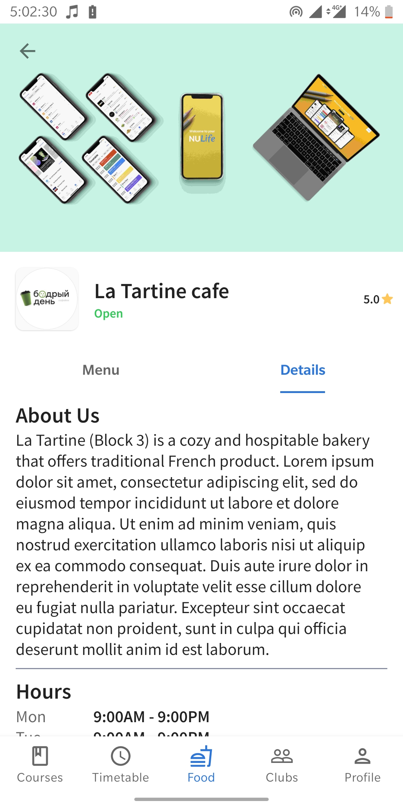
  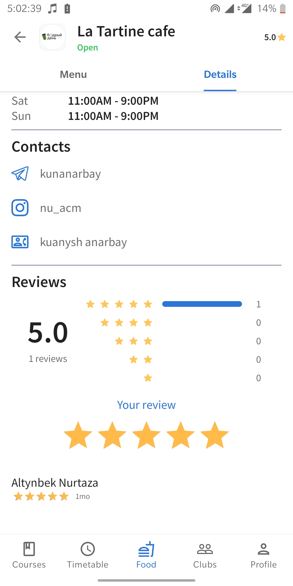
  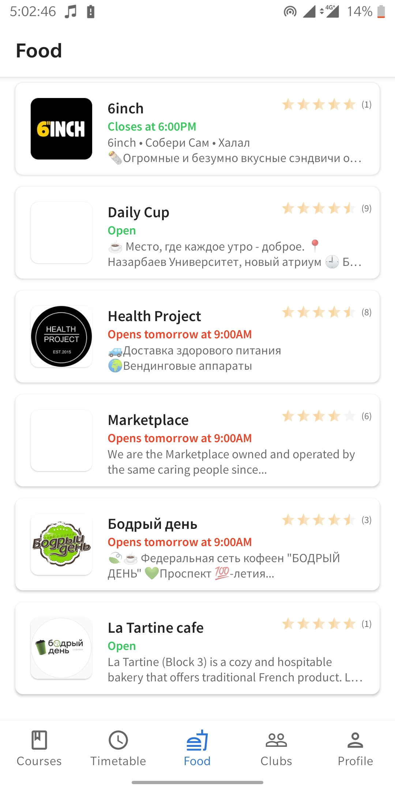
  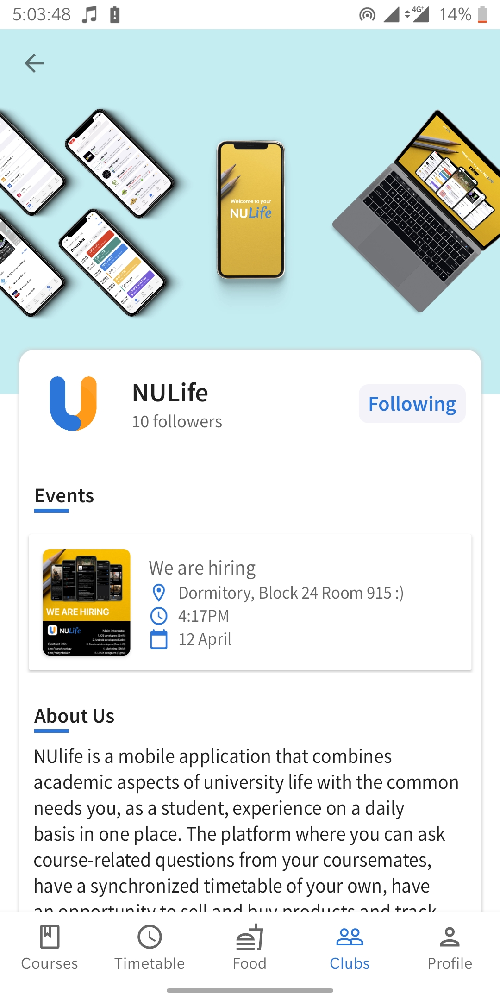
  
  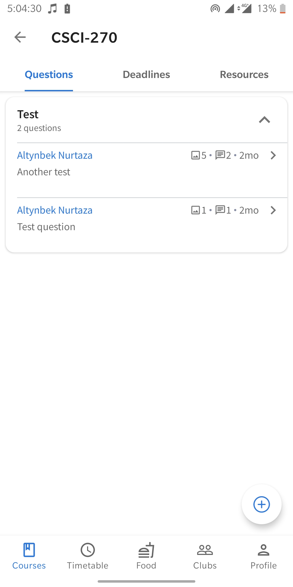
  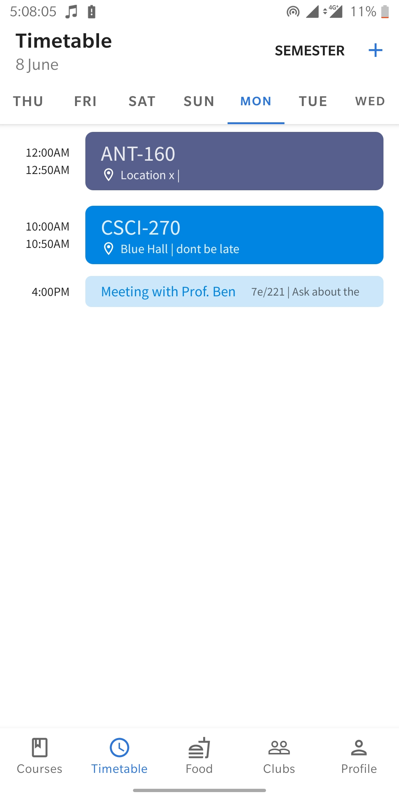
  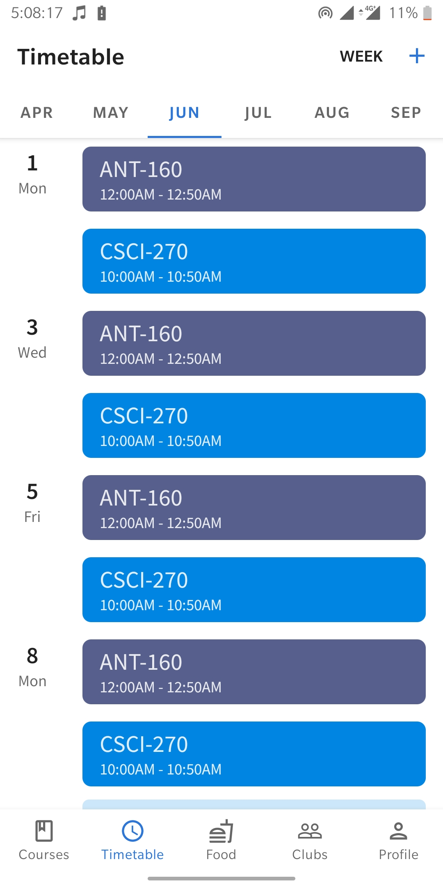
  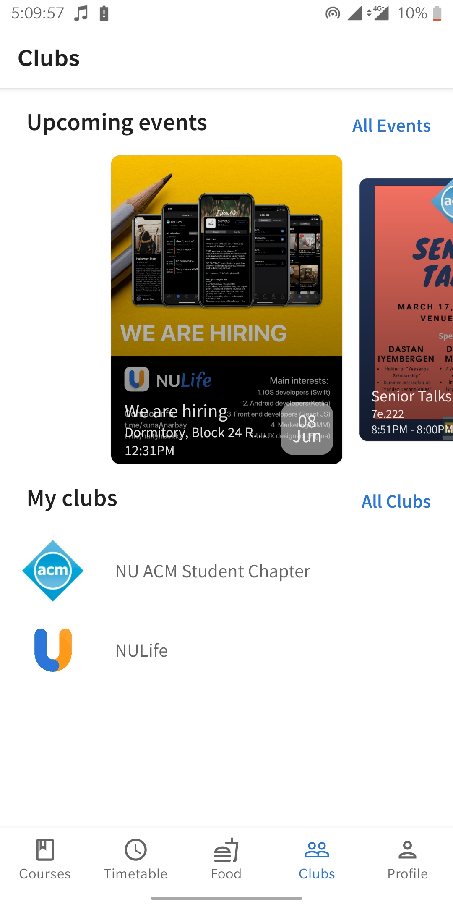
  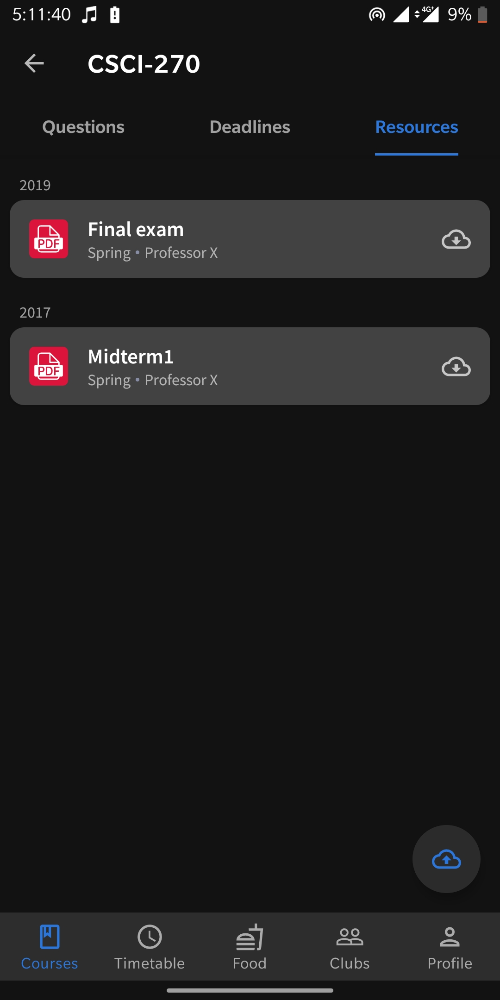
  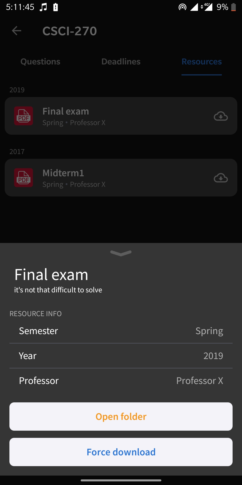
  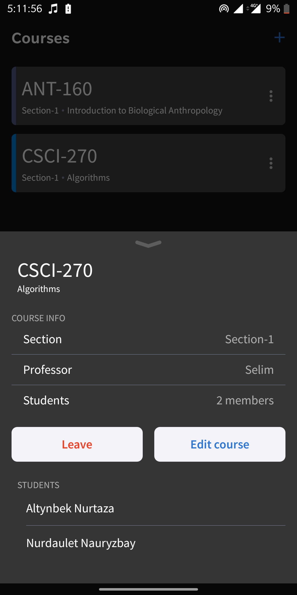

